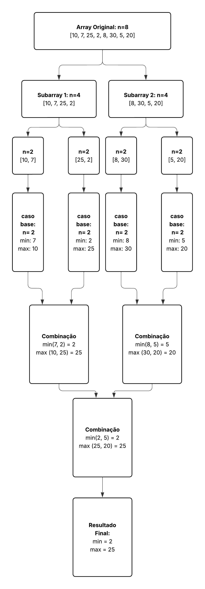

# Trabalho Individual 2 FPAA - Algoritmo de Seleção Simultânea (MaxMin Select)

## Descrição do Projeto
Implementação do algoritmo de seleção simultânea do maior e do menor elementos de uma sequência, conhecido como **MaxMin Select**. Utilizando a abordagem de **divisão e conquista**, o algoritmo divide o problema recursivamente em subproblemas menores, cujas soluções são combinadas para encontrar o resultado final de forma eficiente. Essa técnica reduz o número total de comparações necessárias em comparação com uma abordagem ingênua.

## Como Executar o Projeto

### Pré-requisitos
- Python 3.x instalado

### Execução
**1.** Clone o repositório:
```bash
git clone https://github.com/jojianp/trabalho_individual_2_FPAA.git
cd trabalho_individual_2_FPAA
```

**2.** Execute o programa:
```bash
python main.py
```

**3.** O programa solicitará que você digite uma sequência de números qualquer.

**4.** Digite os números, separando-os por espaço, e pressione Enter quando terminar a digitação.

**5.** O programa apresentará um Array dos números digitados, identificando o menor e o maior elemento nele presentes.

### Exemplo de Execução
```
Digite os números separados por espaço: 10 7 25 2 8 30 5 20 1 15

Sequência digitada: [10, 7, 25, 2, 8, 30, 5, 20, 1, 15]
Menor elemento: 1
Maior elemento: 30
```

## Análise Detalhada do Código

### Explicação Linha a Linha

```
maxMinSelect.py
```

**Linha 1. Definição da função**: `def max_min_select(arr):` - Define a função que recebe um Array de números `arr` como parâmetro.

**Linha 2. Tamanho do Array**: `n = len(arr)` - Define o tamanho do array pelo 'len'

**Linha 4. Caso base 1**: `if n == 1:` - Verifica se o Array tem apenas um elemento. Se sim, ele é o menor e o maior.

**Linha 5. Retorno do caso base 1**: `return arr[0], arr[0]` - Retorna o único elemento como mínimo e máximo.

**Linha 7. Caso base 2**: `if n == 2:` - Verifica se o Array tem dois elementos. Este é o menor/melhor caso em que apenas uma comparação é necessária.

**Linhas 8-11. Comparação única**: `if arr[0] < arr[1]: ... else: ...` - Compara os dois elementos e os retorna na ordem (menor, maior).

**Linha 13. Divisão**: `mid = n // 2` - Calcula o índice do meio do Array para a divisão.

**Linhas 14-15. Subproblemas**: `left_half = arr[:mid]` e `right_half = arr[mid:]` - Divide o Array em duas metades.

**Linhas 17-18. Conquista (Chamadas Recursivas)**: `min_left, max_left = max_min_select(left_half)` e `min_right, max_right = max_min_select(right_half)` - Chama a função recursivamente para cada metade, resolvendo os subproblemas.

**Linha 20. Combinação (Mínimo)**: `final_min = min(min_left, min_right)` - Combina os resultados comparando o menor da esquerda com o menor da direita para achar o mínimo global.

**Linha 21. Combinação (Máximo)**: `final_max = max(max_left, max_right)` - Compara o maior da esquerda com o maior da direita para achar o máximo global.

**Linha 23. Retorno final**: `return final_min, final_max` - Retorna a tupla com o menor e o maior valor da lista original.


```
main.py
```

**Linha 1. Importação**: `from maxMinSelect import max_min_select` - Importa a função `max_min_select` do módulo `maxMinSelect.py`.

**Linha 3. Bloco principal**: `if __name__ == "__main__":` - Verifica se o script está sendo executado diretamente (não importado como módulo).

**Linha 4. Entrada de dados**: `entrada = input("Digite os números separados por espaço: ")` - Solicita ao usuário que digite uma sequência de números separados por espaço.

**Linhas 6-8. Validação de entrada vazia**: 
```python
if not entrada.strip():
    print("Erro: Nenhum número foi digitado. O array está vazio!")
    exit()
```
Verifica se o usuário apenas pressionou Enter sem digitar números.

**Linha 10. Conversão para lista de inteiros**: `sequencia = list(map(int, entrada.split()))` - Converte a string de entrada em uma lista de inteiros.

**Linha 12. Exibição do array**: `print(f"\nArray da Sequência digitada: {sequencia}")` - Exibe a lista de números digitada.

**Linha 14. Chamada da função**: `menor, maior = max_min_select(sequencia)` - Chama a função `max_min_select` passando a lista de números e recebe o menor e o maior valor.

**Linhas 16-17. Exibição dos resultados**: `print(f"Menor elemento do Array: {menor}")` e `print(f"Maior elemento do Array: {maior}")` - Exibe o menor e o maior elemento do array.

# Relatório Técnico

## Análise da Complexidade Ciclomática

### Fluxo de Controle da Função max_min_select
1. Início da função `max_min_select(arr)`
2. Verificação de condição `if n == 1:`
   - Se verdadeiro, retorna `(arr[0], arr[0])`
   - Se falso, continua
3. Verificação de condição `if n == 2:`
   - Se verdadeiro, compara os dois elementos `if arr[0] < arr[1]:` 
        - Se verdadeiro, retorna `return arr[0], arr[1]`
        - Se falso, retorna `return arr[1], arr[0]`
   - Se falso, continua
4. Calcula o ponto médio `mid = n // 2`
5. Divide o array em duas metades
6. Chamada recursiva para a metade esquerda
7. Chamada recursiva para a metade direita
8. Compara os mínimos das metades
9. Compara os máximos das metades
10. Retorna o resultado final

### Grafo de Fluxo

#### Nós
```
Nó 1: Início da função
Nó 2: n = len(arr)
Nó 3: if n == 1
Nó 4: return (arr[0], arr[0])
Nó 5: if n == 2
Nó 6: if arr[0] < arr[1] (verdadeiro)
Nó 7: return (arr[0], arr[1])
Nó 8: return (arr[1], arr[0]) (falso do nó 6)
Nó 9: mid = n // 2
Nó 10: left_half = arr[:mid]
Nó 11: right_half = arr[mid:]
Nó 12: min_left, max_left = max_min_select(left_half)
Nó 13: min_right, max_right = max_min_select(right_half)
Nó 14: final_min = min(min_left, min_right)
Nó 15: final_max = max(max_left, max_right)
Nó 16: return (final_min, final_max)
```

#### Arestas
```
N1 -> N2
N2 -> N3
N3 -> N4
N3 -> N5
N5 -> N6
N5 -> N9
N6 -> N7
N6 -> N8
N9 -> N10
N10 -> N11
N11 -> N12
N12 -> N1 (primeira chamada recursiva)
N12 -> N13
N13 -> N1 (segunda chamada recursiva)
N13 -> N14
N14 -> N15
N15 -> N16
```

**Arestas no grafo (E):** 19
**Nós no grafo (N):** 16
**Componentes conexos (P):** 1

### Cálculo da Complexidade Ciclomática

* **M = E - N + 2P**
* E = 19 (arestas)
* N = 16 (nós)
* P = 1 (componente conexo)
* M = 19 - 16 + 2*1
* M = 5

### Representação Visual


# Relatório Técnico

## Análise da Complexidade Assintótica

### Pelo Método de Contagem de Operações

O algoritmo divide recursivamente o array em duas metades até que as sublistas contenham apenas um ou dois elementos. Para cada divisão, ele realiza comparações para combinar os valores máximo e mínimo de cada metade.

- **Divisão**: O array de tamanho n é dividido em duas metades de tamanho n/2.
- **Combinação**: Após cada chamada recursiva, apenas 2 comparações são necessárias para combinar os resultados de ambas as metades.

Assim, o número total de comparações C(n) pode ser descrito pela seguinte recorrência:

```
C(n) = C(n/2) + C(n/2) + 2 para n > 2
C(2) = 1 (caso base: uma comparação entre dois elementos)
C(1) = 0 (caso base: um único elemento é tanto mínimo quanto máximo)
```

**Resolvendo a recorrência:**
Cada divisão cria dois subproblemas com n/2 elementos cada.
Cada etapa de combinação faz 2 comparações de tempo constante.

Portanto, temos:
```
C(n) = 2 * C(n/2) + 2
```

A partir deste padrão, o número total de comparações cresce linearmente com o tamanho da entrada, então a complexidade temporal é **O(n)**.

### Pela Aplicação do Teorema Mestre

Utilizamos a recorrência de tempo de execução do algoritmo:
```
T(n) = 2T(n/2) + O(1)
```

Aplicamos o Teorema Mestre na forma:
```
T(n) = a · T(n/b) + f(n)
```

**1. Identificação dos valores de a, b e f(n):**
- `a = 2`: o número de subproblemas
- `b = 2`: o fator pelo qual o tamanho da entrada é reduzido
- `f(n) = O(1)`: o custo do trabalho de combinação, que é constante

**2. Cálculo de log_b a:**
- Calculamos `p = log₂ 2 = 1`

**3. Determinação do caso do Teorema Mestre:**
- Comparamos `f(n) = O(1)` com `n^p = n¹`
- Como `O(1)` é assintoticamente menor que `n¹`, a recorrência se enquadra no **Caso 1** do Teorema Mestre, onde `f(n) = O(n^(p-ε))` para `ε = 1`

**4. Solução assintótica (T(n)) da fórmula:**
- Pelo Caso 1, a solução é `T(n) = Θ(n^p)`
- Substituindo `p`, a solução é **Θ(n)**

## Diagrama Visual da Divisão e Conquista

Para ilustrar a estrutura hierárquica da recursão do algoritmo, foi criado um diagrama visual. Ele mostra como o problema original é dividido em subproblemas e como seus resultados são combinados para obter a solução final. O diagrama está localizado na pasta `assets` e referenciado abaixo.



## Conclusão
Ambas as análises - por contagem de operações e pelo Teorema Mestre - confirmam que o algoritmo MaxMin Select possui complexidade temporal **Θ(n)**, demonstrando sua eficiência em encontrar simultaneamente os elementos máximo e mínimo de uma sequência.

## Referências

1. **CARNEIRO ARAMUNI, J. P.** AULA 01_Análise de complexidade de algoritmos.pdf. Material de aula. Disponível em: `https://github.com/joaopauloaramuni/fundamentos-de-projeto-e-analise-de-algoritmos/tree/main/PDF`
2. **CORMEN, T. H. et al.** *Introduction to Algorithms*. 3rd ed. MIT Press, 2009.